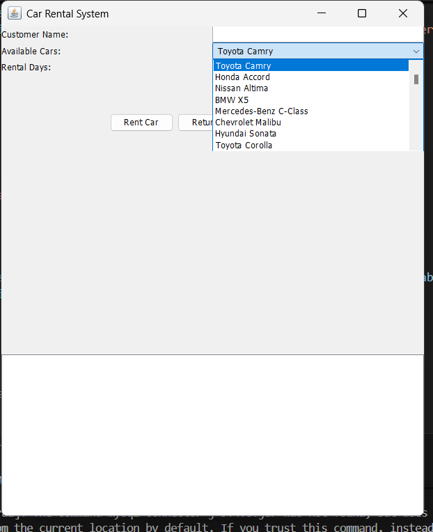
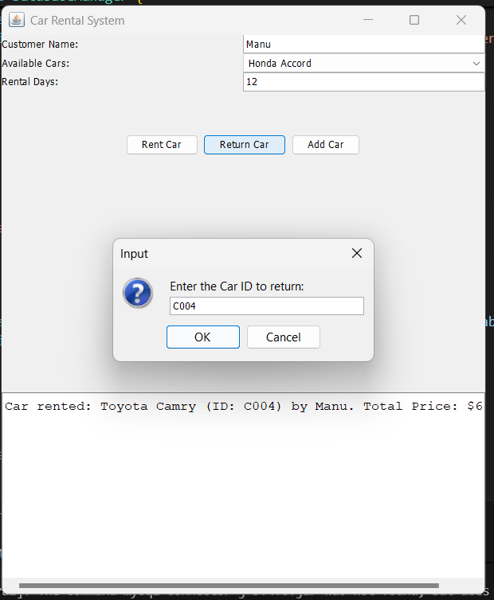

# G4 Car Rental Management System

This is a simple Car Rental Management System desktop application built with Java Swing and MySQL.

## Screenshots







## Prerequisites

*   Java Development Kit (JDK) 8 or later
*   MySQL Server

## Setup and Installation

### 1. Database Setup

1.  **Start your MySQL server.**
2.  **Create a new database** named `car_rental_system`. You can use the following SQL command:
    ```sql
    CREATE DATABASE car_rental_system;
    ```
3.  **Use the newly created database:**
    ```sql
    USE car_rental_system;
    ```
4.  **Create the necessary tables.** The `database_setup.sql` file is missing the `cars` table definition. Run the following SQL command to create the `cars` table:
    ```sql
    CREATE TABLE cars (
        car_id VARCHAR(255) PRIMARY KEY,
        brand VARCHAR(255) NOT NULL,
        model VARCHAR(255) NOT NULL,
        base_price_per_day DOUBLE NOT NULL,
        is_available BOOLEAN NOT NULL
    );
    ```
5.  **Run the `database_setup.sql` script** to create the `customers` and `rentals` tables.
6.  **(Optional) Populate the `cars` table** with sample data by running the `insert_150_cars.sql` script.

### 2. Configure Database Credentials

*   Open the `DatabaseManager.java` file.
*   If your MySQL root password is not `root`, change the `DB_PASSWORD` constant to your MySQL password:
    ```java
    private static final String DB_PASSWORD = "your_password"; // Change this to your MySQL root password
    ```

## How to Run the Project

### 1. Compile the Code

Open a terminal or command prompt in the project's root directory (`d:\G4_CarRantalManagementSystem`) and run the following command to compile the Java source files. This command includes the MySQL connector JAR in the classpath.

```powershell
javac -cp "mysql-connector-j-9.4.0.jar" *.java
```

### 2. Run the Application

After successful compilation, run the application using the following command. This command also includes the MySQL connector JAR and the current directory in the classpath.

```powershell
java -cp ".;mysql-connector-j-9.4.0.jar" Main
```

The Car Rental System GUI should now appear.

### Admin Login

The application has a simple admin login to add new cars.
*   **Username:** admin
*   **Password:** 12345
